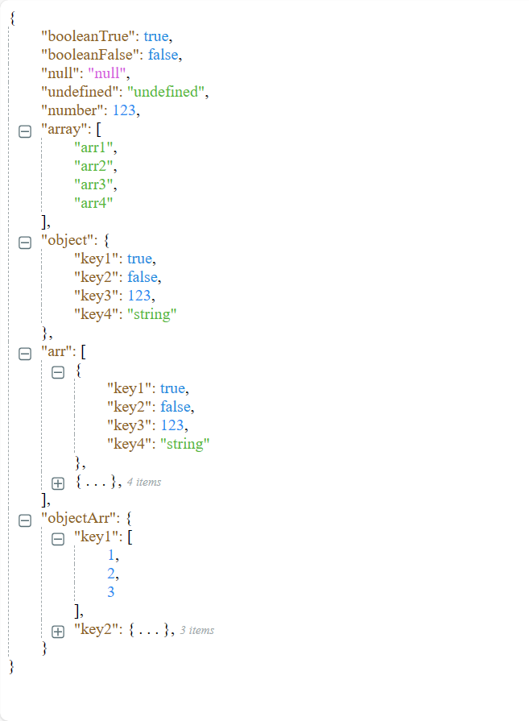

<h1 align="center">
  <a href="https://github.com/guochengfeng/vue-view-json.git" target="_blank">Vue View Json</a>
</h1>

<div align="center">

<p>A Vue component for rendering JSON data as a tree structure.</p>
<p>It supports Vue3 at least.</p>

[](https://travis-ci.org/guochengfeng/vue-view-json)
[](https://www.npmjs.org/package/vue-view-json)
[](https://github.com/guochengfeng/vue-view-json/blob/master/LICENSE)
[](https://bundlephobia.com/result?p=vue-view-json)
[](https://www.npmtrends.com/vue-view-json)
[](https://github.com/guochengfeng/vue-view-json/issues)

</div>

[](https://github.com/guochengfeng/vue-view-json.git)

English | [简体中文](./README.zh_CN.md)

## Features

- As a JSON Formatter.
- ...

## Using NPM or Yarn

```bash
$ npm install vue-view-json --save
```

```bash
$ yarn add vue-view-json
```

## Usage

```vue
<template>
  <div>
    <vue-view-json :json="{ key: 'value' }" />
  </div>
</template>

<script>
import VueViewJson from 'vue-view-json';

export default {
  components: {
    VueViewJson,
  },
};
</script>
```

## Props

| Property                 | Description                                                 | Type                              | Default |
| ------------------------ | ----------------------------------------------------------- | --------------------------------- | ------- |
| json                     | JSON data                                                   | JSON object                       | -       |
| deep                     | Paths greater than or equal to this depth will be collapsed | number                            | 4       |
| showLength               | Show the length when collapsed                              | boolean                           | true   |
| showLine                 | Show the line                                               | boolean                           | true    |
| showIcon                 | Show the icon                                               | boolean                           | true   |
| showDoubleQuotes         | Show doublequotes on key                                    | boolean                           | true    |
| rootPath                 | Root data path                                              | string                            | `root`  |
| collapsedOnClickBrackets | Support click brackets or text  to collapse                 | boolean                           | true    |
| renderNodeKey            | render node key                                             | ({ node, defaultKey }) => vNode   | -       |
| renderNodeValue          | render node value                                           | ({ node, defaultValue }) => vNode | -       |
| nodeClick                | triggered when a node is clicked                            | ({ isClosed, path }) => void      | -       |

## Events

| Event Name     | Description                              | Parameters           |
| -------------- | ---------------------------------------- | -------------------- |
| nodeClick      | triggers when click node                 | (node: NodeData)     |

## Contributors

<a href="https://github.com/guochengfeng/vue-view-json/graphs/contributors">
  
</a>
